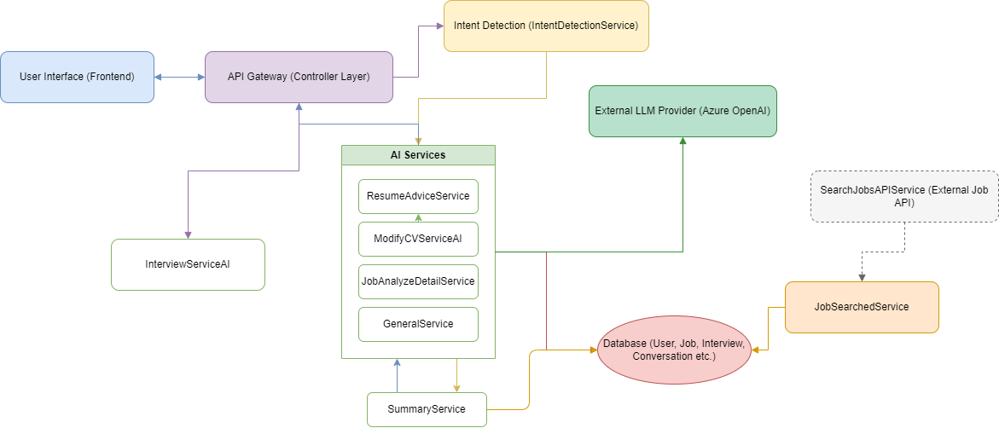

# Job Agent: AI-Powered Job Search Assistant

Job Agent is a modern, AI-driven platform designed to help users find, analyze, and prepare for tech job opportunities. It leverages advanced language models to provide personalized job recommendations, resume advice, job analysis, and interview simulations—all through a conversational interface.

---

## Technologies Used

**Frontend:**
- React 19
- TypeScript
- Vite
- Tailwind CSS
- Radix UI

**Backend:**
- Java 21
- Spring Boot 3
- Spring Data MongoDB
- Spring Security
- Azure OpenAI (GPT-4o)
- Cloudinary (for media)

**Database:**
- MongoDB


---

## Project Architecture & Flow

The system is composed of:
- **User Interface (Frontend):** Modern, responsive chat and job browsing experience.
- **API Gateway (Backend Controller Layer):** Receives and routes user requests.
- **Intent Detection:** Classifies user messages to determine their intent (job search, resume advice, etc.).
- **AI Services:** Specialized services for job matching, resume analysis, job detail analysis, general Q&A, and interview simulation.
- **Database:** Stores user profiles, job data, and interview sessions.
- **External LLM Provider:** Azure OpenAI (GPT-4o) powers the agent's intelligence.

**See the editable architecture diagram:** [`jobagent-ai-architecture.drawio`](./jobagent-ai-architecture.drawio) (open with [draw.io](https://app.diagrams.net/) or compatible tools).

---

## Architecture (High Level)

Below is a high-level overview of the Job Agent system architecture:



This diagram illustrates the core components and their interactions within the system, showing how user requests flow through the application from the frontend interface to backend services and external APIs.

---

## Features
- Conversational job search and recommendations
- Resume/CV analysis and personalized advice
- Job detail analysis and suitability feedback
- Technical interview simulation with feedback and scoring
- User authentication and profile management
- Clean, modern, and responsive UI

---

## Getting Started

### Prerequisites
- Node.js (v18+ recommended)
- Java 21
- MongoDB instance (local or remote)
- Docker and Docker Compose (optional, for containerized deployment)

### 1. Backend (Spring Boot API)

#### Option A: Running directly with Gradle

```bash
cd job-agent-api
./gradlew build
./gradlew bootRun
```

- The backend will start on [http://localhost:8080](http://localhost:8080) by default.
- Configure your MongoDB and Azure OpenAI credentials in the appropriate config files or environment variables (see .env.example for reference).

#### Option B: Running with Docker Compose

```bash
cd job-agent-api

cp .env.example .env

nano .env 
docker-compose up -d
```

- This will start the Spring Boot application along with MongoDB instances.
- The backend will be available at [http://localhost:8080](http://localhost:8080).
- All required services will be containerized and networked together.

### 2. Frontend (React App)

```bash
cd jobagent
npm install
npm run dev
```

- The frontend will start on [http://localhost:5173](http://localhost:5173) by default.
- Make sure the backend is running for full functionality.

---

## Editing the Architecture Diagram
- Open `jobagent-ai-architecture.drawio` in [draw.io](https://app.diagrams.net/) or any compatible diagram editor.
- You can update, export, or share the diagram as needed.

---

## Contributing
- Pull requests and issues are welcome!
- Please follow best practices for code style and commit messages.
- For major changes, open an issue first to discuss what you would like to change.

---

## License
This project is licensed under the MIT License.
